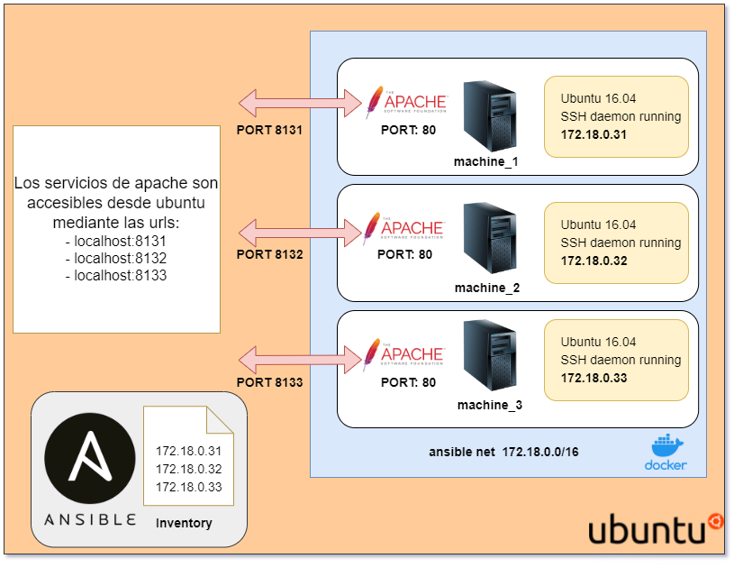

# docker_ansible_env
Demo de creación de máquinas ubuntu creadas con Docker y ejemplos ansible. Ha sido testeado en una distribución 20.04.3 LTS. Si se quiere probar en otra distribución se debe cambiar el método para instalar ansible, sshpass, curl y docker. El método con el que se ha instalado Docker obliga a usar sudo para el lanzamiento de comandos. Mira la sección de más info al final para cambiar este comportamiento.

# Esquema

En este esquema se muestran los componentes que se van a crear. Notar que las máquinas ubuntu al pertenecer a la misma red se pueden comunicar entre ellas.



## Instalamos ansible sshpass y curl (si no está instalado en la máquina Ubuntu)

```bash
sudo apt-get update -y
sudo apt install ansible -y
sudo apt-get install sshpass -y
sudo apt install curl -y
```

## Instalamos docker (si no está instalado en la máquina Ubuntu)

```bash
curl -fsSL https://get.docker.com -o test-docker.sh
sudo sh test-docker.sh
```

## Modificamos el fichero hosts de ansible

```bash
sudo nano /etc/ansible/hosts
```

Contenido a añadir:

```bash
[servers]
server1 ansible_host=172.18.0.31 ansible_ssh_user=root ansible_ssh_pass=ansiblepass
server2 ansible_host=172.18.0.32 ansible_ssh_user=root ansible_ssh_pass=ansiblepass
server3 ansible_host=172.18.0.33 ansible_ssh_user=root ansible_ssh_pass=ansiblepass
[all:vars]
ansible_python_interpreter=/usr/bin/python3
```

## Creamos una subnet

```bash
sudo docker network create --subnet=172.18.0.0/16 ansiblenet
```

## Creamos una imagen personalizada lista para poder conectarse via ssh y que contiene lo que nosotros queremos

```bash
sudo docker build -t ansibleenvssh .
```

## Creamos 3 contenedores con la imagen previamente creada

```bash
sudo docker run -p 8131:80 --net ansiblenet --ip 172.18.0.31 --name machine_1 -d ansibleenvssh
sudo docker run -p 8132:80 --net ansiblenet --ip 172.18.0.32 --name machine_2 -d ansibleenvssh
sudo docker run -p 8133:80 --net ansiblenet --ip 172.18.0.33 --name machine_3 -d ansibleenvssh
```

## Conectamos con los contenedores mediante. La contraseña es ansiblepass (mirar Dockerfile):

Accedemos a los 3 contenedores.

```bash
ssh root@172.18.0.31
ssh root@172.18.0.32
ssh root@172.18.0.33
```

## Comando ansible para ver el uso de disco

```bash
ansible all -a "df -h" -u root
```

## Comando ansible para ver el tiempo que lleva conectado cada servidor

```bash
ansible servers -a "uptime" -u root
```

## Comando ansible para instalar apache

```bash
ansible-playbook install_apache.yml
```

## Dentro de cada contenedor añadimos esta línea en el fichero /etc/apache2/apache2.conf
ServerName 127.0.1

## Salimos del contenedor (dentro de contenedor)

```bash
exit
```

## Reiniciamos apache

```bash
ansible-playbook restart_apache.yml
```

## Comprobamos que el apache del contenedor funciona
- http://localhost:8131/
- http://localhost:8132/
- http://localhost:8133/

## Eliminamos todas las keygen (ojo, la carpeta home del usuario actual es juan)

```bash
ssh-keygen -f "/home/juan/.ssh/known_hosts" -R "172.18.0.31"
ssh-keygen -f "/home/juan/.ssh/known_hosts" -R "172.18.0.32"
ssh-keygen -f "/home/juan/.ssh/known_hosts" -R "172.18.0.33"
```

## Paramos los contendores

```bash
sudo docker stop machine_1 machine_2 machine_3
```

## Borramos los contendores

```bash
sudo docker rm machine_1 machine_2 machine_3
```

## Borramos las imagenes

```bash
sudo docker rmi ansibleenvssh
sudo docker rmi ubuntu:16.04
```

## Borramos la red

```bash
docker network rm ansiblenet
```

## Comandos que pueden resultar útiles:

### Listado de imágenes

```bash
sudo docker images
```

### Listado de contenedores funcionando

```bash
sudo docker ps -a
```

### Listado de las redes

```bash
sudo docker network ls
```

### Listado de los equipos en inventario

```bash
ansible-inventory --list -y
```

# Más Info
- https://conpilar.es/como-usar-docker-sin-sudo-en-ubuntu/
- https://www.danielcastanera.com/comandos-utiles-en-docker/

